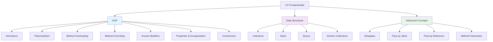

# C# OOP, Data Structures, Collections & LINQ

A comprehensive educational project demonstrating core C# concepts including Object-Oriented Programming, data structures, collections, and LINQ queries.

## 📚 Project Overview

This project is designed to help developers master fundamental C# concepts through practical examples and implementations. It covers OOP principles, working with various data structures and collections, and best practices for modern C# development.

## 📊 Topics Overview



## 🎯 Key Topics Covered

### 1. **Object-Oriented Programming (OOP)**
- **Inheritance**: Parent and child class relationships
- **Method Overloading**: Multiple methods with the same name but different parameters
- **Method Overriding**: Child classes overriding parent implementations
- **Access Modifiers**: Public, private, protected
- **Properties**: Using getters and setters for encapsulation
- **Constructors**: Initialization with default parameters

### 2. **Data Structures & Collections**
- **LinkedList**: Sequential data structure with nodes
- **Stack**: Last-In-First-Out (LIFO) collection
- **Queue**: First-In-First-Out (FIFO) collection
- **Generic Collections**: Type-safe generic collections

### 3. **Advanced C# Concepts**
- **Delegates**: Type-safe function pointers for callbacks
- **Pass by Value vs Reference**: Understanding parameter passing mechanisms
- **Method Parameters**: Regular parameters vs `ref` keyword

## 📁 Project Structure

### Core Classes

- **`Perant.cs`**: Base parent class demonstrating:
  - Properties with getters and setters
  - Constructors with default parameters
  - Method overloading
  - Protected methods
  - Pass by value vs reference with `ref` keyword

- **`Child.cs`**: Child class demonstrating:
  - Inheritance from parent class
  - Method overriding
  - Calling base class methods
  - Implementing new methods

- **`Delegate.cs`**: Delegate implementation example

- **`Program.cs`**: Main entry point showcasing:
  - OOP concepts in action
  - Data structures usage (LinkedList, Stack, Queue)
  - Practical demonstrations

## 🚀 Getting Started

### Prerequisites
- .NET 9.0 or later
- C# knowledge (beginner to intermediate level)

### Running the Project

```bash
dotnet run
```

This will execute the `Program.cs` file and demonstrate all the concepts with console output.

### Building the Project

```bash
dotnet build
```

## 💡 How to Use This Project

1. **Review the Classes**: Start by examining `Perant.cs` to understand the base class structure
2. **Explore Inheritance**: Look at `Child.cs` to see how inheritance works
3. **Run the Program**: Execute the project to see all concepts in action
4. **Experiment**: Modify the code to experiment with different scenarios
5. **Study the Output**: Pay attention to console output to understand behavior

## 📖 Key Concepts Explained

### Inheritance
The `Child` class inherits from `Perant`, gaining access to protected and public members while adding its own functionality.

### Method Overloading
The `Add` method in `Perant` has multiple versions with different parameters, allowing flexible method calls.

### Pass by Reference
Using the `ref` keyword allows methods to modify the original variable passed as a parameter, unlike pass by value.

### Collections
The program demonstrates how to use LinkedList, Stack, and Queue for different scenarios:
- **LinkedList**: For flexible insertions/deletions
- **Stack**: For LIFO operations
- **Queue**: For FIFO operations

## 📝 Notes

This is an educational project suitable for:
- Learning C# fundamentals
- Understanding OOP principles
- Practicing with data structures
- Experimenting with language features

## 🔗 Resources

- [Microsoft C# Documentation](https://docs.microsoft.com/en-us/dotnet/csharp/)
- [C# OOP Concepts](https://docs.microsoft.com/en-us/dotnet/csharp/fundamentals/object-oriented/)
- [Collections in .NET](https://docs.microsoft.com/en-us/dotnet/api/system.collections.generic)